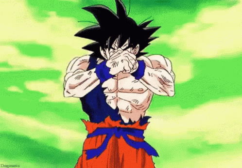
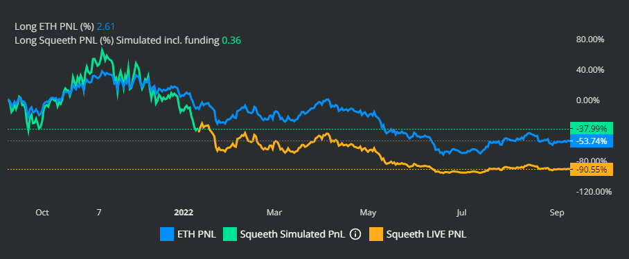

# 📸 TL;DR – The Ultrashort Summary

Did you ever <mark style="background-color:purple;">**want to take on leverage**</mark> because you were bullish on an asset?

But you did not leverage up because of <mark style="background-color:red;">**all the associated risks**</mark>** ** ☠️?


This is a common problem among crypto plebs, degens and even pros.[ I mean Su Zhu got liquidated for god's sake!](https://nymag.com/intelligencer/article/three-arrows-capital-kyle-davies-su-zhu-crash.html) 😱


If price moves against you, your position can get liquidated...

....meaning your assets are kaput, GONE, **VANISHED**.

### Rebalancing Your Debt

Instead, in SIR, <mark style="background-color:green;">**the borrowed capital is adjusted as price fluctuates**</mark>.&#x20;

1. Price of your asset goes up :chart\_with\_upwards\_trend: ➠ take on more debt and invest more!
2. Price goes down :chart\_with\_downwards\_trend: ➠ better pay off some of your debt (to avoid getting liquidated).

You may say... but this is no different than leveraged ETFs such as [ETH2X-FLI](https://indexcoop.com/ethereum-flexible-leverage-index-eth2xfli).

<mark style="color:red;">**THE PROBLEM**</mark> with all these leveraged ETFs is that the your portfolio will go down over the long-term if the underlying remains flat!



See [Squeeth](https://squeeth.opyn.co/) as an example:

<figure><figcaption>
On May the price of ETH was the same than in the beginning of the chart, but Squeeth had already lost a fair chunk of value. 😥
</figcaption></figure>

### New DeFi Primitive

Thanks to a our new design,

* [x] <mark style="background-color:orange;">**SIR rebalances instantly,**</mark> <mark style="background-color:orange;"></mark><mark style="background-color:orange;">removing the pernicious volatility decay</mark>
* [x] and charges <mark style="background-color:blue;">**no fee while holding a position**</mark>.

Compound your gains with perfect leverage and avoid liquidation.

<figure><figcaption>
Price of the leveraged token tracks the underlying as q=p^l.  Your gains q compound as the price of the underlying p increases.
</figcaption></figure>


Now you can <mark style="background-color:purple;">**`hold your leveraged position for as long as you wish`**</mark> and your money will not dissipate away.


Happy investing. [🎉](https://emojipedia.org/party-popper/)
