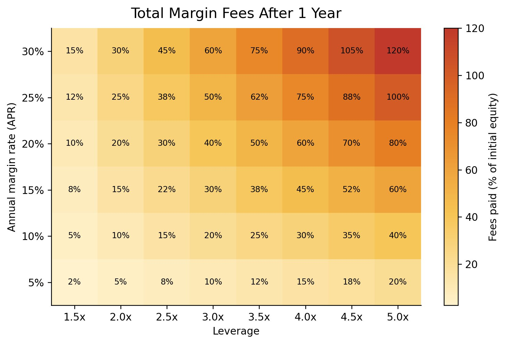
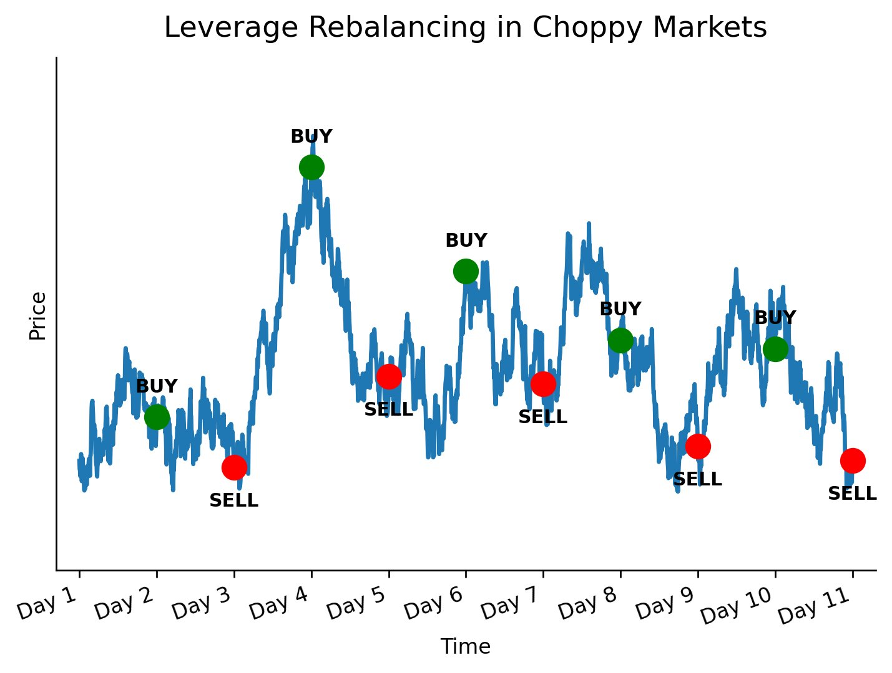
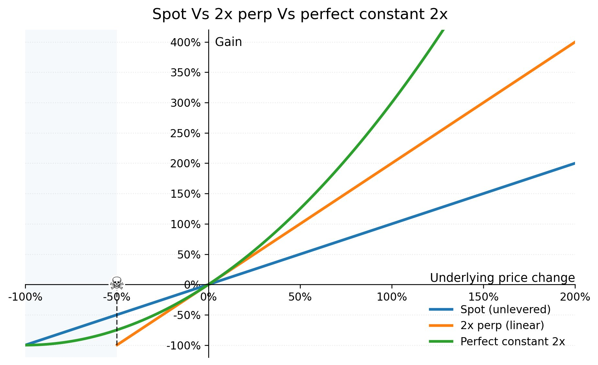
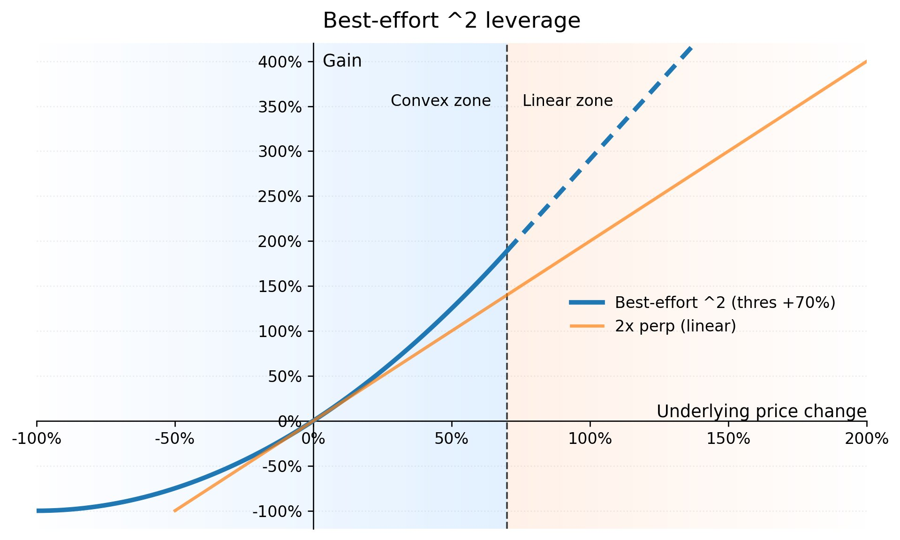
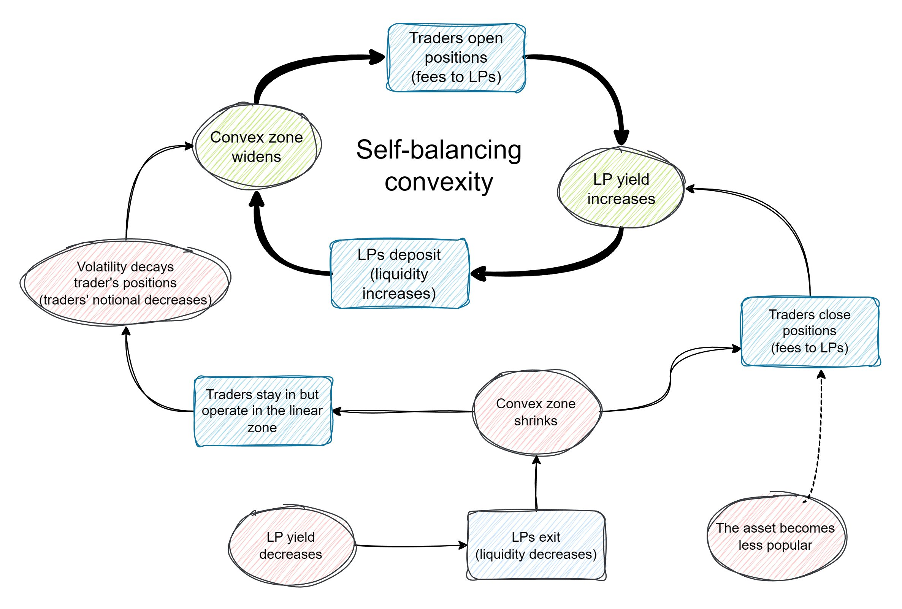

# 💡 Why SIR Matters

## A New Primitive

DeFi has produced a handful of genuine financial primitives — mechanisms so fundamental they become building blocks for everything else. AMMs let anyone provide liquidity. Flash loans enabled atomic arbitrage. Perpetuals brought leveraged exposure on-chain. Each was dismissed early and recognized late.

Big jumps happen when the primitive changes, not when you sand down the old one. Bitcoin did not come from polishing payment rails, and AMMs did not come from tweaking TradFi order books. SIR is the same pattern: a new primitive that unlocks payoff shapes you simply cannot get by patching perps, leverage tokens, or options. SIR is not "slightly better perps" or "less bad leverage tokens". It is a different primitive for holding leverage.

## Holding Leverage Is Practically Impossible

The trader and the investor are often described as disjoint types of participants: traders use leverage for short-term bets, investors hold spot for the long run. Can leverage be holdable for months, or even years? To see why that has basically not been possible, look at the main leverage tools we have today:

**1. Margin trading** — You borrow funds to increase your position size. You pay a borrow rate, so the longer you hold, the more you bleed. You can get liquidated if price moves against you. Holding a margin position is paying rent over time.

<figure><figcaption>
Total margin fees after one year, as a percentage of initial equity. Even moderate leverage at moderate rates eats a significant share of your position.
</figcaption></figure>

**2. Leveraged tokens/ETFs** — Lever up by taking on more debt as price goes up, deleverage by selling as price goes down. This keeps leverage quasi-constant and avoids liquidation. What breaks: volatility decay. In choppy markets you repeatedly buy high and sell low. Range-bound price action turns the rebalancing mechanic into a slow bleed.

<figure><figcaption>
Leverage rebalancing in choppy markets. The mechanism buys at local highs and sells at local lows — a systematic bleed even when price ends flat.
</figcaption></figure>

**3. Perps** — Cash-settled synthetic exposure with no borrowing of the underlying. This is what made x100 leverage possible. What breaks: liquidations become the norm. At x100, a -1% move wipes out the entire position.

**4. Call options** — Amplified exposure without liquidation risk. What breaks: the price depends not only on the underlying but also on volatility and time to expiration. As expiration approaches, the option decays in value.

| Approach | Volatility Decay | Ongoing Fees | Liquidation | Practical Hold Duration |
|----------|:---:|:---:|:---:|:---:|
| Margin Trading | — | Funding rates | Yes | Days to weeks |
| Leveraged ETFs/Tokens | Severe | Hidden (rebalancing) | No | Degrades over time |
| Perpetuals | — | Funding rates | Yes | Days to weeks |
| Options | Time decay | Premium | Expiration | Fixed term |
| **SIR** | **Best-effort no** | **One-time mint fee** | **No** | **Unlimited** |

## An Original Approach to Holdable Leverage

In an ideal world, a holdable leverage product would:
1. Charge only a one-time fee, and
2. Maintain the leverage perfectly constant at every price tick

A one-time fee eliminates the recurrent bleed from funding and borrowing. Perfectly constant leverage removes liquidation risk and produces the payoff curve people intuitively expect from leverage: compounding gains as price moves up.

<figure><figcaption>
Spot vs 2x perp (linear) vs perfect constant 2x leverage. The convex green curve is what constant leverage actually looks like — superlinear gains on the upside, bounded losses on the downside. The skull marks the liquidation point for a 2x perp.
</figcaption></figure>

The problem is that promising superlinear gains forever at a finite one-time fee is unfeasible. Something has to give.

### Best-Effort Convexity

SIR solves this by promising convex returns only up to a certain price threshold. Beyond that threshold, returns become linear — basically like a perp. The key is that this threshold is not fixed. It is dynamic, and depends on the ratio between trader notional and LP inventory:

- **More LP inventory** → higher threshold (bigger convex zone)
- **Less LP inventory** → lower threshold (smaller convex zone)

SIR provides **unconditionally**:
1. Zero risk of liquidation
2. No recurrent fees — just a one-time fee

SIR provides **on a best-effort basis**:
3. Convex returns
4. No volatility decay

With the right one-time fee, we can incentivize the right ratio between traders and LPs, so the system operates in the convex zone most of the time. For the full math behind the payoff formula, see [Take on Leverage and Forget](take-on-leverage-and-forget.md).

<figure><figcaption>
Best-effort ^2 leverage. In the convex zone (blue), returns compound superlinearly. Beyond the saturation threshold, returns become linear (dashed) — like a perp, but still without liquidation.
</figcaption></figure>

### Self-Balancing Convexity

The convex and linear zones are not static. They adjust based on the ratio between traders' notional and LP inventory, creating a natural feedback loop:

**The main loop:**
1. Traders open positions → they pay a one-time fee to LPs
2. LP yield increases → more LPs deposit liquidity
3. More LP inventory → the convex zone widens
4. Wider convex zone → opening positions becomes more attractive
5. Return to step 1

**When the system drifts out of balance:**
- If LPs exit, inventory drops and the convex zone shrinks. Some traders then close, sending more fees to LPs and pushing LP yield back up.
- If traders don't close, they end up operating in the linear zone. There leverage is no longer perfectly constant, volatility decay slowly eats the position, and over time the system naturally migrates back toward a wider convex zone.

The threshold is not a fixed parameter — it is an organic variable, steered by fees and liquidity, with the system constantly nudging itself back toward the convex zone.

<figure><figcaption>
The self-balancing convexity loop. The top cycle (black arrows) is the main growth flywheel. The bottom paths show how the system self-corrects when liquidity drops.
</figcaption></figure>

## Real Utility

This isn't just a trading toy. Holdable leveraged tokens unlock use cases that were previously impractical:

- **Long-term directional bets** — Bullish on ETH over the next year? Take 1.5x exposure and forget about it. No maintenance, no margin calls, no daily check-ins.
- **Capital-efficient hedging** — Hedge a portfolio position with less capital at risk than a full short would require.
- **Leverage you can sleep on** — No liquidation means no 3 AM margin calls. Your worst case is the minting fee, not your entire position.
- **Composability** — APE tokens are standard ERC-20s. They can be held, transferred, or integrated into other protocols like any other token.

## Multi-Chain

SIR is live on **Ethereum**, **HyperEVM**, and **MegaETH**, with the same core mechanics on each chain. See [Deployments](../deployments.md) for contract addresses across all chains.
