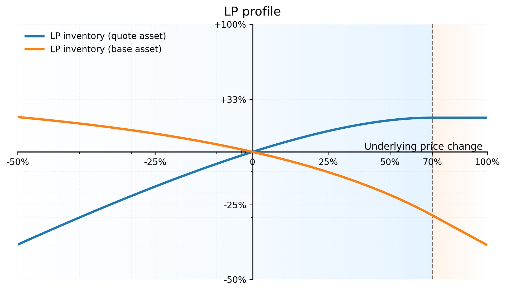

# 🫗 Liquidity and Leverage

Vault creation in SIR is open to anyone and is defined by three key parameters: the collateral token (COL), the debt token (DBT), and the leverage ratio ($$l$$). There are two types of users: gentlemen (liquidity providers or LPers) and the apes (traders). Gentlemen mint TEA tokens by depositing collateral, earning fees generated from the trading activities of the apes. Similarly, apes mint APE tokens, a leveraged COL/DBT token, by also depositing collateral. TEA tokens are ERC-1155, and APE tokens are ERC-20. The reserve of collateral in the vault, $$R$$, is always split between the gentlemen and the apes

$$
R=G+A.
$$

At any time a gentleman can claim their part of $$G$$ proportionally to their TEA balance, and similarly the apes can claim their part of $$A$$.&#x20;

### Fees

**From Apes:** Vaults charge a one-time fee when minting and burning APE tokens. The fee scales with leverage — for example, ~9% for $$l=1.5$$ and ~17% for $$l=2$$. These fees are substantial upfront but allow apes to hold APE tokens without incurring any maintenance fees, regardless of the holding period. The fee is roughly equivalent to one year of funding on a perps position, striking a balance between potential returns and upfront costs.

**From LPers:** LPers are charged a 4.9% fee when minting TEA. Without this fee, an actor could mint TEA, collect a share of protocol fees, and then immediately burn the TEA, extracting value without taking on meaningful risk. The minting fee aligns LP incentives with the long-term health of the protocol.

This fee is allocated to [Protocol-Owned Liquidity (POL)](protocol-owned-liquidity.md), which participates in the vault as a permanent LPer. POL continues to accumulate rewards and deepens liquidity over time, contributing to the overall resilience of the system.

## The Limits of Constant Leverage

Let's define $$p$$ as the current price of the collateral (COL) in terms of the debt token (DBT). For instance, if COL = ETH and DBT = USDC, then $$p$$ is the ETH/USDC price. Ideally, the apes' claim on the reserve, $$A$$, adapts based on the power-law function of constant-leverage:

$$
A'=\left(\frac{p'}{p}\right)^{l−1}A,
$$

where $$A'$$ is the new value of the apes' reserve, $$p'$$ is the new price, $$p$$ is the original price, and $$l$$ is the leverage. This constant leverage regime is the preferred regime but it cannot, logically, be sustained for any price $$p'$$ since $$A'$$ can escalate indefinitely.

To maintain the leverage ratio $$l$$, an additional $$l-1$$ units of liquidity are required for every $$1$$ unit held by the apes. The saturation price, $$p_\textrm{sat}$$, signifies the threshold at which liquidity is fully utilized, i.e., when $$G=(l-1)A$$. Therefore, the vault can accommodate any price movement within the $$[0,p_\textrm{sat}]$$ range without disrupting the constant leverage — this is the **convex zone**.

Importantly, $$p_\textrm{sat}$$ is not static; it adjusts based on the $$G/A$$ ratio, reflecting changes in the gentlemen's liquidity versus the apes' positions. Specifically, $$p_\textrm{sat}$$ increases when gentlemen add liquidity or apes reduce their leveraged positions, and it decreases otherwise.

<figure><figcaption>
Best-effort ^2 leverage across different liquidity levels. More LP inventory (higher G/A ratio) pushes the saturation threshold further out, giving traders a wider convex zone.
</figcaption></figure>

## The Saturation Zone

The saturation zone is initiated when the market price surpasses $$p_\textrm{sat}$$, shifting away from the ideal constant leverage scenario to a liquidity-constrained state, where $$G<(l-1)A$$. Beyond $$p_\textrm{sat}$$, the amount owed to the gentlemen denominated in debt token (DBT) becomes fixed: $$D=G_\textrm{sat}p_\textrm{sat}$$, thereby fixing their reserve portion to

$$
G'=\frac{D}{p'}=\frac{p}{p'}G.
$$

In practical terms, if COL = ETH and DBT = USDC, in this regime the gentlemen's reserve value is calculated in USDC, while the apes benefit from the appreciation of ETH versus USDC. This mirrors a conventional margin long position with the initial leverage $$l$$. Similar to traditional margin trading, as the price continues to climb, the effective leverage ratio experienced by the apes diminishes.

<figure><figcaption>
LP (gentleman) profit profile. In the convex zone (blue), LPs gain quote-asset exposure as price rises and base-asset exposure as price falls. Beyond saturation (orange), LP value in quote terms is fixed.
</figcaption></figure>


**Volatility decay in saturation:** When a vault operates in the saturation zone, leverage is no longer perfectly constant. Price oscillations in this zone cause the same buy-high-sell-low dynamic seen in traditional leveraged tokens, gradually eroding the position's value. The deeper into saturation, the more pronounced the decay. This is why deep LP liquidity matters — it keeps $$p_\textrm{sat}$$ high and the convex zone wide.

